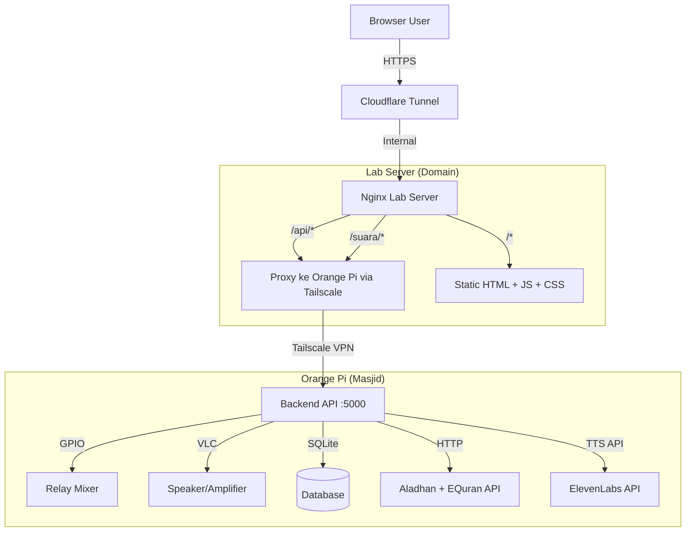

# Implementation Plan: Split Monolith → Frontend + Backend

## Ringkasan

Memisahkan Announcer Pro yang saat ini monolitik (Flask + Jinja2 templates + serve static) menjadi dua bagian terpisah:

- **Backend (Orange Pi)** — REST API, audio player, TTS, scheduler, GPIO, database
- **Frontend (Lab Server)** — Static SPA (HTML + JS + Tailwind), di-serve Nginx, di-deploy via Cloudflare Tunnel

---

## Arsitektur Baru



### Alur Koneksi Detail

```
Browser → https://domain.com
  ↓
Cloudflare Tunnel → Lab Server (internal)
  ↓
Nginx:
  ├── /*         → serve static files (langsung, no backend)
  ├── /api/*     → proxy_pass http://100.x.x.x:5000 (via Tailscale)
  └── /suara/*   → proxy_pass http://100.x.x.x:5000 (audio preview)
  ↓
Orange Pi (100.x.x.x:5000) — Backend API Server
  ↓
  Proses → JSON response → balik lewat jalur sama
```

---

## Tahapan Pekerjaan

### Phase 1: Persiapan & Analisis (Estimasi: 1 hari)

- [x] Baca dan pahami seluruh codebase existing
- [ ] Identifikasi semua endpoint yang perlu ada di backend API
- [ ] Identifikasi semua data flow frontend→backend
- [ ] Tentukan stack backend API (FastAPI vs Flask)
- [ ] Tentukan mekanisme auth (JWT)

### Phase 2: Backend API — Orange Pi (Estimasi: 3-4 hari)

#### 2.1 Setup Project Baru

```
orangepi-backend/
├── app/
│   ├── __init__.py
│   ├── main.py              # Entry point FastAPI/Flask
│   ├── config.py            # Pindah dari config.py, tambah env vars
│   ├── auth.py              # JWT authentication (ganti session)
│   ├── database.py          # EXISTING (minor adjust)
│   ├── audio_player.py      # EXISTING (no change)
│   ├── tts_engine.py        # EXISTING (no change)
│   ├── api_service.py       # EXISTING (no change)
│   ├── scheduler_service.py # EXISTING (no change)
│   ├── routers/
│   │   ├── __init__.py
│   │   ├── health.py        # GET /api/health
│   │   ├── status.py        # GET /api/status
│   │   ├── announce.py      # POST /api/announce, POST /api/stop
│   │   ├── playback.py      # POST /api/play-murottal, /set-volume, /toggle-mixer
│   │   ├── studio.py        # POST /api/proses-suara, /upload-audio
│   │   ├── schedules.py     # POST /api/schedules, /api/schedules/{id}/toggle
│   │   ├── logs.py          # GET /api/logs, /api/recent-logs
│   │   └── audio.py         # GET /api/audio/{filename}, GET /api/audio-list
│   └── models/
│       └── schemas.py       # Pydantic models (FastAPI)
├── requirements.txt
├── .env.example
└── announcer-api.service    # systemd
```

#### 2.2 Endpoint API Backend

**Auth:**
| Method | Endpoint | Fungsi |
|--------|----------|--------|
| POST | `/api/login` | Login, return JWT token |
| POST | `/api/verify` | Verify token validity |

**Health & Status:**
| Method | Endpoint | Fungsi |
|--------|----------|--------|
| GET | `/api/health` | Cek backend hidup |
| GET | `/api/status` | Status Orange Pi, speaker, mixer, playback |

**Announcement:**
| Method | Endpoint | Fungsi |
|--------|----------|--------|
| POST | `/api/announce` | Terima teks/audio, TTS → play ke speaker |
| POST | `/api/stop` | Stop semua audio |
| GET | `/api/history` | Riwayat pengumuman |

**Playback Control (existing):**
| Method | Endpoint | Fungsi |
|--------|----------|--------|
| POST | `/api/play-murottal` | Putar streaming surah |
| POST | `/api/set-volume` | Set volume 0-100 |
| POST | `/api/toggle-mixer` | Toggle relay mixer ON/OFF |
| GET | `/api/playback-status` | Status playing, volume, mixer |

**Studio:**
| Method | Endpoint | Fungsi |
|--------|----------|--------|
| POST | `/api/proses-suara` | Generate audio via TTS |
| POST | `/api/upload-audio` | Upload file audio |
| GET | `/api/audio-list` | Daftar audio library |
| DELETE | `/api/audio/{id}` | Hapus audio |

**Prayer & Surah:**
| Method | Endpoint | Fungsi |
|--------|----------|--------|
| GET | `/api/prayer-times` | Jadwal sholat |
| GET | `/api/surah-list` | Daftar surah |

**Schedules:**
| Method | Endpoint | Fungsi |
|--------|----------|--------|
| GET | `/api/schedules` | Daftar jadwal |
| POST | `/api/schedules` | Tambah jadwal |
| PUT | `/api/schedules/{id}` | Edit jadwal |
| DELETE | `/api/schedules/{id}` | Hapus jadwal |
| POST | `/api/schedules/{id}/toggle` | Aktif/nonaktif jadwal |

**Audio Serving:**
| Method | Endpoint | Fungsi |
|--------|----------|--------|
| GET | `/api/audio/{filename}` | Serve file audio untuk preview |

**Logs:**
| Method | Endpoint | Fungsi |
|--------|----------|--------|
| GET | `/api/logs` | Semua log (limit 50) |
| GET | `/api/recent-logs` | 3 log terbaru |

#### 2.3 Auth Mechanism — JWT

Ganti dari `Flask session` ke `JWT (JSON Web Token)`:

**Backend:**
- `POST /api/login` → validasi username/password → return `{ token: "eyJ..." }`
- Setiap endpoint punya `Depends(get_current_user)` (FastAPI) atau decorator
- Token expire 24 jam (configurable)
- Secret key dari environment variable

**Frontend:**
- Login form → POST `/api/login` → simpan token di `localStorage`
- Setiap fetch() tambah header: `Authorization: Bearer <token>`
- Jika 401 → redirect ke halaman login

#### 2.4 Config → Environment Variables

Pindah dari hardcoded `config.py` ke `.env`:

```env
# App
APP_SECRET_KEY=your-secret-key-here
APP_PORT=5000

# Auth
ADMIN_USERNAME=admin
ADMIN_PASSWORD=password
JWT_SECRET_KEY=jwt-secret-key-here
JWT_EXPIRE_HOURS=24

# Audio
AUDIO_DIR=./suara_tersimpan
PIN_RELAY=7

# TTS
ELEVENLABS_API_KEY=sk_...
ELEVENLABS_VOICE_ID=IKne3meq5aSn9XLyUdCD
ELEVENLABS_MODEL=eleven_multilingual_v2
EDGE_TTS_VOICE=id-ID-ArdiNeural

# External API
ALADHAN_API_URL=http://api.aladhan.com/v1/timingsByCity?city=Pangkalpinang&country=Indonesia&method=11
EQURAN_API_URL=https://equran.id/api/v2/surat

# Cache
AUDIO_CACHE_TTL=21600
SURAH_CACHE_TTL=86400
```

#### 2.5 Systemd Service

Update dari `announcer-pro.service` → `announcer-api.service`:

```ini
[Unit]
Description=Announcer Backend API — Orange Pi
After=network.target network-online.target tailscaled.service
Wants=network-online.target

[Service]
Type=simple
User=orangepi
WorkingDirectory=/home/orangepi/announcer-backend
EnvironmentFile=/home/orangepi/announcer-backend/.env
ExecStart=/home/orangepi/announcer-backend/venv/bin/python -m uvicorn app.main:app --host 0.0.0.0 --port 5000
Restart=always
RestartSec=5

[Install]
WantedBy=multi-user.target
```

Dependency ke `tailscaled.service` — backend hanya boleh start setelah Tailscale up.

#### 2.6 Dependencies Baru

Tambahkan ke `requirements.txt`:
- `fastapi` atau tetap `flask` + `flask-jwt-extended`
- `python-multipart` (file upload)
- `python-dotenv`
- `flask-cors` atau `starlette.middleware.cors`
- JWT library

---

### Phase 3: Frontend — Static SPA (Estimasi: 3-4 hari)

**Yang akan dikerjakan di fase ini (oleh user/kita):**

- [ ] Konversi `templates/base.html` → `index.html` (layout without Jinja2)
- [ ] Konversi `templates/dashboard.html` → dashboard static
- [ ] Konversi `templates/studio.html` → studio static
- [ ] Konversi `templates/manajemen.html` → manajemen static
- [ ] Konversi `templates/logs.html` → logs static
- [ ] Konversi `templates/login.html` → login static + JWT handling
- [ ] Implementasi auth flow di JS (login → simpan token → kirim header)
- [ ] Ganti semua `url_for(...)` dengan path absolut
- [ ] Ganti semua `render_template` data dengan `fetch()` calls
- [ ] Testing integrasi dengan backend via Tailscale

**Struktur frontend:**

```
frontend-dashboard/
├── index.html           # Dashboard (ex-dashboard.html)
├── login.html           # Login page (JWT version)
├── studio.html          # Studio AI
├── manajemen.html       # Manajemen jadwal
├── logs.html            # Log sistem
├── js/
│   ├── tailwind.js      # Tailwind standalone
│   ├── api.js           # Helper: fetch wrapper with JWT
│   └── auth.js          # Login/logout/token management
└── assets/
```

---

### Phase 4: Integrasi & Deploy ke Orange Pi (Estimasi: 1-2 hari)

- [ ] Setup Tailscale di Orange Pi (join network)
- [ ] Clone backend repo ke Orange Pi
- [ ] Setup Python venv + install dependencies
- [ ] Konfigurasi `.env`
- [ ] Setup systemd service
- [ ] Test: `curl http://localhost:5000/api/health`
- [ ] Test: `curl http://IP-TAILSCALE:5000/api/health`
- [ ] Test: `curl -X POST http://IP-TAILSCALE:5000/api/login -d "username=admin&password=password"`
- [ ] Test: POST /api/announce with JWT token
- [ ] Test: POST /api/stop
- [ ] Test: GET /api/status

---

### Phase 5: Setup Lab Server & Nginx (oleh tean)

- [ ] Setup Cloudflare Tunnel ke Lab Server
- [ ] Konfigurasi Nginx:
  - Serve static frontend
  - Proxy `/api/*` ke Orange Pi via Tailscale
  - Proxy `/suara/*` ke Orange Pi via Tailscale
- [ ] Konfigurasi domain, SSL (Cloudflare)
- [ ] Copy frontend static files ke server
- [ ] Testing end-to-end dari browser public

---

### Phase 6: Testing End-to-End (Estimasi: 1 hari)

- [ ] Test login flow (frontend → API → JWT → session)
- [ ] Test play murottal
- [ ] Test stop audio
- [ ] Test mixer toggle
- [ ] Test TTS generate + play
- [ ] Test scheduler (tunggu jadwal)
- [ ] Test audio preview di browser
- [ ] Test upload audio
- [ ] Test panic button
- [ ] Test reboot Orange Pi → backend auto-start
- [ ] Test Tailscale disconnect/reconnect

---

## Timeline Keseluruhan

| Phase | Estimasi | Keterangan |
|-------|----------|------------|
| 1. Persiapan | 1 hari | Analisis, decision stack |
| 2. Backend API | 3-4 hari | Coding backend baru |
| 3. Frontend SPA | 3-4 hari | Konversi ke static |
| 4. Deploy Orange Pi | 1-2 hari | Install, test |
| 5. Lab Server & Nginx | 1 hari | Oleh tean |
| 6. Testing E2E | 1 hari | Full integration test |
| **Total** | **~10-12 hari** | |

---

## Risiko & Mitigasi

| Risiko | Dampak | Mitigasi |
|--------|--------|----------|
| Latency Tailscale tinggi | Delay response | Test dulu latency. Jika >50ms, optimasi endpoint |
| Tailscale disconnect | Dashboard tidak bisa kontrol | Scheduler tetap jalan lokal di Orange Pi |
| Token JWT expire pas lagi operasi | Request ditolak | Auto-refresh token, atau expire panjang (24-48h) |
| CORS blocking | Fetch gagal | Pastikan backend allow origin domain frontend |
| File audio besar → slow proxy | Preview loading lambat | Nginx buffer/proxy cache, atau kompres audio |

---

## Implementasi Dimulai Dari?

Rekomendasi urutan pengerjaan:

1. **Backend API dulu** — karena frontend butuh endpoint untuk test
2. **Frontend SPA** — setelah backend siap
3. **Deploy Orange Pi** — backend siap, test langsung di hardware
4. **Integrasi Nginx** — setelah backend dan frontend siap
